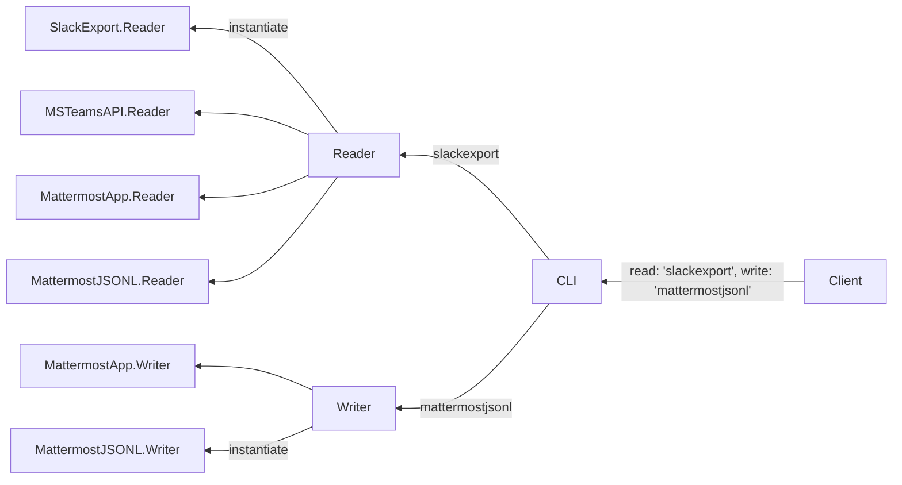
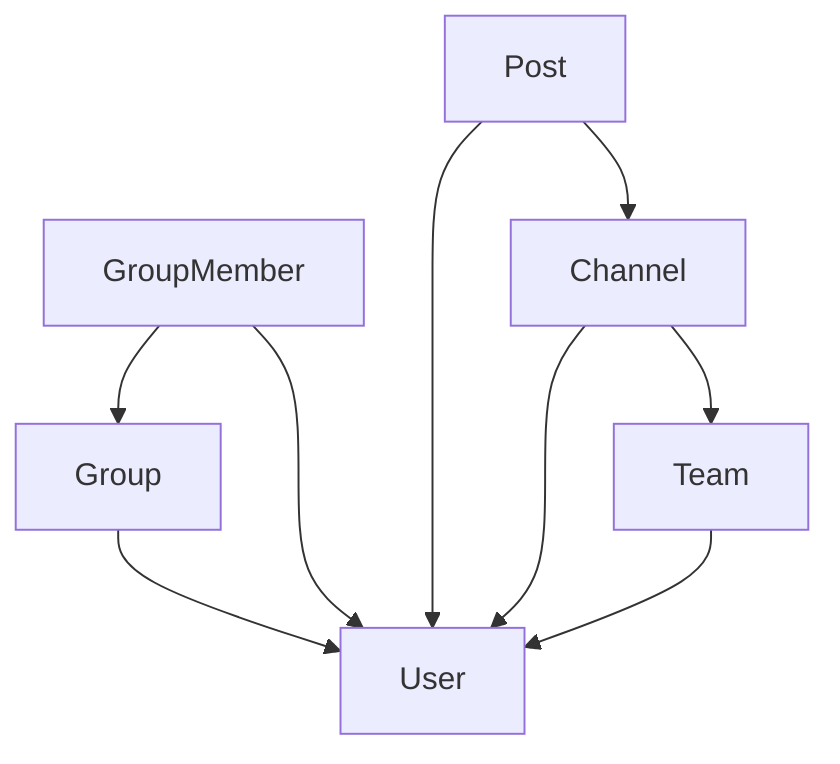

# Import/export Architecture

## Overview



* A reader (ex `SlackExport.Reader`) reads from the Slack export format implementing the `Reader` interface.
* A writer (ex `MattermostJSONL.Writer`) writes to the Mattermermost JSONL format implementing the `Writer` interface.
* The CLI imports the various go modules (which would likely live in their own repositories) and instantiates the appropriate concrete implementation based on the client input.
* The client coult import into or export out of Mattermost, the architecture supports both.

## Sample code

* [`harbour-cli` is a fake CLI application](https://github.com/mkraft/harbour-cli/blob/main/main.go)
* Pretend the following go modules live in their own repositrories:
    * [`slackexport` is an example `Reader` library](https://github.com/mkraft/harbour-cli/tree/main/slackexport)
    * [`mattermostjsonl` is an example `Writer` library](https://github.com/mkraft/harbour-cli/tree/main/mattermostjsonl)
* [`mattermost`](https://github.com/mkraft/harbour-cli/tree/main/mattermost) is an example module representing the interfaces and models that the `Reader` and `Writer` libraries have knowledge of. That module could exist or it could just be part of the mattermost server repository.

## Usage

```shell
$ go run .
{"Name":"fake-group1"}
{"Username":"fake.user1"}
{"Username":"fake.user2"}
{"Name":"fake-group2"}
```

## Advanced discussion

1. Perhaps a dependency graph—where each vertex represents a "depends upon" relation—can be used to determined the order of the write operations and required validations (not included in the sample code).


